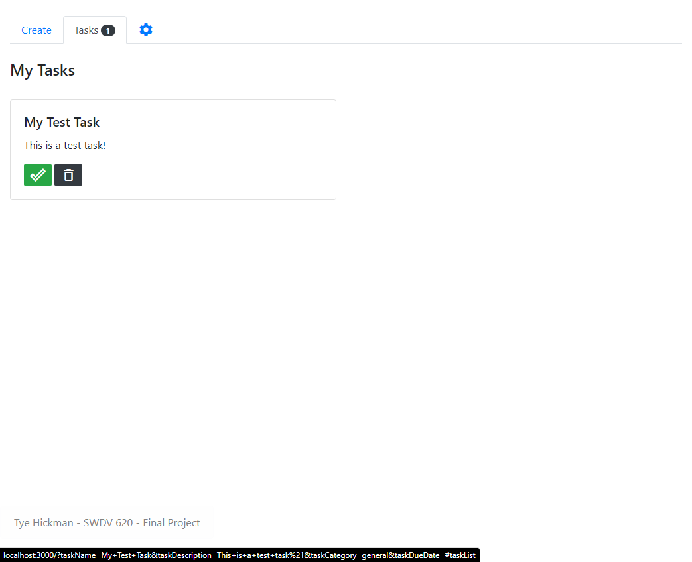

## Tye Hickman
### SWDV 620 Final Project
---
# Contents
- [Introduction](#intro)

- [Getting Started](#GS)
    - [Requirements](#req)
    - [Installation](#inst)
    - [Running Dev Mode](#dev)
    - [Testing](#test)

- [Usage](#usage)
- [Future Plans](#future)
---

# <a name="intro">Introduction</a>

As a SCRUM master, I am always comparing tools that I think could help my team. Having worked for a project management software company in the past and using many different tools along the way, I've wanted to try my hand at making my own Task Management System for some time. Practicing Lean and Agile principles, I thought it would be best to get a minimum viable product written to see if this is an avenue I would like to pursue further. 

Here I submit an MVP proof-of-concept for a basic Task Manager. The functionality is purposefully limited to a scope consistent with project submission. I do hope and intend to keep extending this application to adapt it to my own personal preferences for managing tasks.

It is a pretty common complaint among developers in Agile settings that the tools provided to manage tasks are often over-complicated and sometimes impede the speed at which development happens. The thinking behind this app is to provide an extensible, simple system that developers can add and manage tasks on the fly, giving them a place to organize their work until such a time that it can be further discussed with team members at a ceremony such as a daily stand-up.

---
# <a name="GS">Getting Started</a>

This application was developed with simplicity and usability in mind. There are a few dependencies that are required for installation and testing. Please note that while MongoDB and Mongoose are requirements for this application, I have provided a hosted MongoDB connection for the purposes of submitting this assignment. That Database is scheduled to **self-destruct** on 07/04/2020. I felt this was easier than requiring and setting up a self hosted MongoDB instance.

## <a name="req">Requirements</a>

With a cloud-based Mongo instance, the only real requirement to run this application is Node.js. The current LTS version of Node is v12.18.1 but this application was developed wth v8.10.0
- [Node.js](https://nodejs.org/en/)

## <a name="inst">Installation</a>

With Node.js installed, you can now run '`npm install`'. This will install the necessary packages to run the application. Among these dependencies are:
 - [lodash](https://lodash.com/)
 - [express.js](https://expressjs.com/)
 - [mongoose](https://mongoosejs.com/)
 - [socket.io](https://socket.io/)
 - [uuid](https://www.npmjs.com/package/uuid)

_Note: Angular is listed in the package.json as a dependency. This is because it is being used in on-going development. I don't think any Angular features are used in this version_

## <a name="dev">Running Dev Mode</a>

One of the development dependencies used is [nodemon](https://nodemon.io/). This allows for speedier development by restarting your express server anytime one of your watched files changes. 

Run the script '`npm run dev`' after installing the packages to start the express server with nodemon for a better development experience.

## <a name="test">Testing</a>

Another development dependency for this project is [Jasmine](https://jasmine.github.io/), an easy-to-use Behavior Driven Development (BDD) tool that works really well with node.js.

After runnint the '`npm run dev`' or '`npm start`' script, you can open another terminal window and run the '`npm test`' script. This will run the automated tests and report thier results to the terminal.

# <a name="usage">Usage</a>

Using the app is pretty straight forward. Once you are running either in dev mode or just running, navigate to http://localhost:3000.

You will see some input boxes for you to start adding tasks:

Once you have created some tasks, you can click the Tasks tab to see your tasks:

Once you have completed a task, hit that green checkmard to complete it!

# <a name="future">Future Plans</a>

This project has been a really great introduction to developing web apps. I wish to continue building out the functionality of this project to make it even more extensible and easy to use. My plans for the future of this app are:
 - Set up a Trello board for issue tracking
 - Implement individual user functionality
 - Implement better management of tasks using the Category field
 - Make tasks customizable based on category
 - Implement a dark mode!
